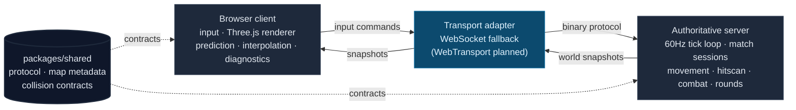

# Breachline

[](LICENSE)
[](tsconfig.base.json)
[](package.json)
[](ROADMAP.md)
[](ROADMAP.md)
[](docs/NETWORKING_MODEL.md)

**An original browser tactical FPS, built server-authority-first.** A TypeScript monorepo where every milestone leaves the project in a verifiable state — input, movement, hitscan, combat, and round flow all live on an authoritative server, while the browser only renders, predicts, and interpolates. Nothing about it copies an existing shooter's names, maps, assets, or presentation.

> **No full game yet — and that's the point.** Breachline is a load-bearing skeleton, not a playable build. There's no hosted demo: it runs locally, and "done" for the current phase means the spine *builds, tests, and proves its networking* rather than that it's fun. See [ROADMAP.md](ROADMAP.md) for the milestone the badge points at.



Ships as three workspaces — a browser client, an authoritative Node server, and a shared protocol package — wired together over a binary message protocol. One command boots the dev server: `npm run dev`.

**See also:** [ARCHITECTURE_SPINE.md](ARCHITECTURE_SPINE.md) for the system boundaries · [GUARDRAILS.md](GUARDRAILS.md) for the non-negotiable rules · [docs/NETWORKING_MODEL.md](docs/NETWORKING_MODEL.md) for the WebTransport plan and fallback · [docs/VALIDATION.md](docs/VALIDATION.md) for what "done" means each phase.

## Why this exists

Most hobby multiplayer shooters die the same way: gameplay gets bolted on before the network model is proven, the client ends up owning truth, and by the time latency and cheating matter the architecture can't absorb them.

Breachline inverts that. It treats the **authoritative server and the transport loop as the hard part** and refuses to add gameplay until each layer underneath is verifiable. Every phase ships one thin, testable slice — a tick loop, then input sequencing, then placeholder snapshots, then server-owned movement, then collision, then hitscan — and each is provable on its own before the next one stacks on top. The result so far is a skeleton you can build, test, and drive in a browser, not a game; the bet is that a game built on this spine survives contact with real networks and hostile clients.

## Run it

### Validate the spine

```powershell
npm install
npm run typecheck          # tsc -b across all workspaces
npm test                   # typecheck + focused node test suite
npm run smoke:transport    # binary message exchange over the fallback adapter
npm run smoke:browser-page # diagnostics page is served
npm run validate           # test + both smokes, the repo-level gate
```

`npm run validate` is the single command that proves the current build is honest: the TypeScript skeleton compiles, focused tests pass, the transport loop exchanges binary messages over the WebSocket fallback, and the diagnostics page serves.

### Local browser inspection

```powershell
npm run dev
```

Open the printed URL (normally `http://127.0.0.1:8787`) and hit **Connect**. The diagnostics page reports RTT stats/history, tick & snapshot cadence, message rates, uptime, match slots, input acknowledgements, server-owned fire/combat/loadout/round state, world snapshots, and — when a second client is present — client prediction/reconciliation and remote interpolation.

Two other local pages:

| Page | URL | What it shows |
| --- | --- | --- |
| **Networked playtest** | `http://127.0.0.1:8787/playtest.html` | Greybox arena over the live connection: local prediction-driven camera, remote stand-ins, a first-person presentation shell, abstract server-fire-result visuals, and compact round/combat readouts. Not a HUD — presentation only, server stays authoritative. |
| **Renderer sandbox** | `http://127.0.0.1:8787/sandbox.html` | Client-only Three.js greybox derived from the map metadata, with optional category/preset/dressing previews of ignored local prototype assets. Touches no server state. |

### Two-player harness & network simulation

```powershell
npm run playtest:harness          # drives two local /playtest.html clients via Playwright, prints evidence
npm run playtest:harness:network  # same path under baseline / latency / jitter / drop profiles
```

The network harness wraps the browser `MessageTransport` path locally only — it reports correction max, remote-interpolation status, fire-result and round-reset observations, and console errors per profile. It does **not** prove WebTransport and does not change server authority. A sandboxed npm/network failure while fetching Playwright is an environment blocker, not a gameplay result.

### Private asset audit

```powershell
npm run audit:private-assets   # writes the ignored local-assets/private-asset-audit.json
```

Local prototype GLBs live under `apps/client/public/assets/private-prototype/` and are **gitignored** — they never ship in the repo. See [docs/PRIVATE_ASSET_AUDIT.md](docs/PRIVATE_ASSET_AUDIT.md).

## The architecture

Three workspaces, three strictly-policed ownership boundaries. Behavior does not move across them without updating [ARCHITECTURE_SPINE.md](ARCHITECTURE_SPINE.md) in the same change.

| Workspace | Owns | Must never |
| --- | --- | --- |
| `apps/server` | Session lifecycle, the fixed 60Hz tick loop, input validation/sequencing, movement, collision, hitscan, combat state, loadouts, round flow, snapshot creation — **all game truth** | Import renderer code or depend on DOM APIs |
| `apps/client` | Browser runtime, input capture, Three.js rendering, prediction/reconciliation, remote interpolation, the diagnostics & playtest pages | Own authoritative simulation, damage, score, or position truth |
| `packages/shared` | Protocol version & message shapes, tick-rate constants, map metadata, greybox collision contracts | Hold simulation authority or renderer logic — contracts only |

**Design choices worth flagging:**

- **The server owns truth, full stop.** Health, death, hit confirmation, round outcome, and authoritative position are computed server-side from accepted inputs. The client predicts and interpolates for feel, but reconciliation always snaps to the server snapshot. This is the single most important property of the system — see [GUARDRAILS.md](GUARDRAILS.md).
- **Transport is an adapter, not an assumption.** The intended path is WebTransport over HTTP/3 (reliable streams for control, datagrams for input/snapshots), but that's blocked locally by HTTP/3/TLS setup, so everything runs today over a **validated WebSocket fallback** behind the same `MessageTransport` interface. Swapping transports doesn't touch gameplay code.
- **Shared is contracts only.** Both sides read the same protocol shapes and the same collision geometry derived from the original arena metadata — so server movement and client prediction stop against identical blockers without duplicating logic.
- **Hostile clients are assumed from day one.** Protocol versioning is explicit, the client's reported hit/health/position is never trusted, and a narrow simulation layer for latency/jitter/loss lives near transport rather than leaking into gameplay rules.
- **Originality is a hard rule.** Names, maps, weapon identities, factions, UI, and callouts stay original or placeholder until a written art direction exists. When in doubt, the project goes more abstract.

## What's authoritative

The server advances a fixed-rate world and emits snapshots; the client never writes back into truth.

```
accept timestamped input  ──►  validate & queue by client sequence
                                        │
                          fixed 60Hz tick advances the world
                                        │
        movement · collision · hitscan · combat · round flow  (server-owned)
                                        │
              emit snapshot  ──►  tagged with server tick + protocol version
                                        │
   client: predict + interpolate for feel  ──►  reconcile to the snapshot (truth)
```

`SERVER_TICK_RATE_HZ` in `packages/shared` defines the target contract. No variable-frame gameplay logic enters the server loop.

## Where it stands

**Phase 36 — local network-condition simulation.** Phases 1–35 built the spine in verifiable slices: repo/docs foundation, transport loop, browser diagnostics, binary protocol, match slots, input sequencing, placeholder snapshots, the Three.js greybox sandbox, server-owned movement, prediction/reconciliation, remote interpolation, arena metadata, the player camera, hitscan validation, combat state, loadouts, round flow, developer telemetry, and the local two-player playtest harness with feel tuning. Phase 36 adds local-only latency/jitter/drop profiles around the browser transport path and harness output.

**Deferred on purpose:** real weapons & gameplay HUD, matchmaking, accounts/persistence, ranked progression, hosted deployment, any external telemetry upload, and WebTransport itself (status kept honest until the HTTP/3/TLS path is solved). The next milestone advances only once the network-condition harness keeps two-client connection, movement/collision, hit/miss visuals, combat/round transitions, reconnect cleanup, diagnostics, and sandbox proofs stable under baseline plus at least one impaired profile.

## Repository layout

```text
apps/
  client/    Browser client, renderer sandbox, diagnostics & playtest pages
  server/    Authoritative server: tick loop, sessions, simulation
packages/
  shared/    Protocol constants, message shapes, map metadata, collision contracts
docs/        Focused design contracts and validation notes
scripts/     Smokes, harnesses, and the private-asset audit
tests/       Focused node test suites per subsystem
```

## Key documents

- [AGENTS.md](AGENTS.md) — instructions for future agents working in this repo
- [GUARDRAILS.md](GUARDRAILS.md) — non-negotiable project rules
- [ARCHITECTURE_SPINE.md](ARCHITECTURE_SPINE.md) — intended system boundaries
- [CODING_STANDARDS.md](CODING_STANDARDS.md) — TypeScript, protocol, and loop standards
- [ROADMAP.md](ROADMAP.md) — milestone plan with the current phase marked
- [docs/NETWORKING_MODEL.md](docs/NETWORKING_MODEL.md) — WebTransport model and fallback path
- [docs/GAMEPLAY_CONTRACT.md](docs/GAMEPLAY_CONTRACT.md) — early gameplay boundaries
- [docs/VALIDATION.md](docs/VALIDATION.md) — done criteria and validation reporting

## License

[MIT](LICENSE) © 2026 Conal
